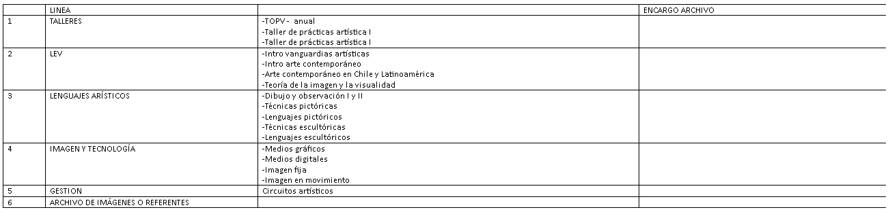

# reu leonor secretaria académica

2026-08-12

reunión inicial

sistemas de monitoreo de los planes de estudio.

levantamiento de info al inicio, medioo, in

cada carrera define instrumentos para levantar esa info

Archivo de prácticas: ver si el estudiantado ha desarrollado una capacidad de relacionar y comprender los investigaciones materiales y conceptualesq que ha ido desarrollando

instancia donde levnatar un archivo que permita inferir si han podido desarrollar capaicdades analíticas.

los estudiantes recolectan y orgaizan todos los trabajos, bitacoras, ejercicios durante sus 2 años, ordeandas en líneas curricularesz

son 3 niveles:

1. barrido de todo elarchivo en carpetas individuales
2. nivel coneptual
3. nivel procedimental

- material y forma

## categorías

franscisco ramos

francisco.ramos@udp.cl
con copia a leonor

## categorías

forma y materiales
nudo conceptual
modos de hacer

### rsumen

3 categorías, 6 líneas() una es personal, 18 cursos.

que cada estudiante suba imagenes de sus trabajos y proyectos. Estos se visulizan de forma diagramatica calsificadas por linea y curso. Luego en otra fase las ubican en torno a 3 categorías. Sí se pueden repetir(ideal avisar que esta repetido al momento de ponerlo).

quizas entre 5-15 imagenes por cada categouría

son 60 estudiantes.

16 cursos.

quizas puede ser un formulario appscript y luego se visualizan en un html donde pueden colocarla en la categoría visualmente.

esto tiene q estar redy ates del período de exámenes(7-21 diciembre). Listo a fines de noviembre.

que se cambie el nombre del archivo.

cada archivo necsitamos saber:

- nombre estudiante(no extraer del mail, preguntar)
- línea
- curso

### importante

lunes mandar una propuesta

- referente: mark lombardi