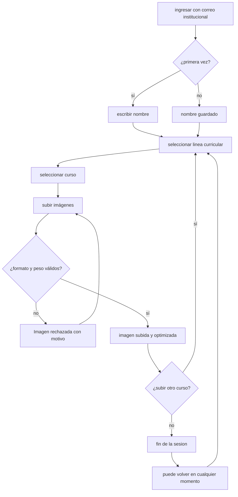

# Propuesta — Archivo de Prácticas

## Objetivo y alcance

Instrumento para levantar proyectos al cierre del 4to semestre de la carrera de Arte. Busca por una parte evaluar el proceso de los estudiantes hasta esa etapa, y por otro promover al estudiantado a establecer relaciones conceptuales entre sus investigaciones materiales y conceptuales.

## Estructura de datos

### Líneas curriculares y cursos

| Línea | Curso | Semestre |
| - | - | - |
| Talleres | Taller de operaciones y procedimientos visuales | S1-S2 |
| Talleres | Taller de prácticas artísticas I | S3 |
| Talleres | Taller de prácticas artísticas II | S4 |
| Estudios Visuales | Introducción a las vanguardias artísticas | S1 |
| Estudios Visuales | Introducción al arte contemporáneo | S2 |
| Estudios Visuales | Arte contemporáneo en Chile y Latinoamérica | S3 |
| Estudios Visuales | Teoría de la imagen | S4 |
| Lenguajes artísticos | Dibujo y observación | S1 |
| Lenguajes artísticos | Dibujo y observación II | S2 |
| Lenguajes artísticos | Técnicas escultóricas | S2 |
| Lenguajes artísticos | Técnicas pictóricas | S3 |
| Lenguajes artísticos | Lenguajes escultóricos | S3 |
| Lenguajes artísticos | Lenguajes pictóricos | S4 |
| Imagen y tecnología | Medios Gráficos | S1 |
| Imagen y tecnología | Medios Digitales | S2 |
| Imagen y tecnología | Imagen fija | S3 |
| Imagen y tecnología | Imagen en movimiento | S4 |
| Gestión | Circuitos Artísticos | S1 |
| Personal | Archivo de imágenes o referentes | - |

### Categorías

- **Forma y materiales**
- **Nudo conceptual**
- **Modos de hacer**

## Arquitectura

El sistema se compone de 3 partes:

| Pieza | Función |
| - | - |
| Formulario Web | Interfaz de subida. Valida, optimiza y envía las imágenes |
| Apps Script | Recibe las imágenes, las guarda en drive y registra los datos en un spreadsheet |
| Visualizador | Lee y muestra los proyectos y datos desde drive y el spreadsheet. También agrega la categoría a la que se asoció el proyecto al spreadsheet |

- Acceso: la identidad del estudiante se obtiene a través del ingreso con el correo institucional
- Registro: Cada imagen genera una fila en la planilla con: correo, nombre, línea, curso, semestre, tipo de archivo, localización drive, categoría.
- Guardado: A medida que se suben las imágenes, se van guardando en drive. Una vez terminado el formulario y confirmado por el usuario, se pasan los datos a spreadsheet. El código cuenta con LocalStorage, por lo que avances quedan guardados en el navegador de manera local.

## Formulario de subida

### Diagrama de flujo



También disponible [aquí](./img/flujo.png)

### Formatos y límites

Las imágenes deben ser subidas en formato PNG, JPG o JPEG(el formulario no admite HEIC o similares). Al subir una imagen, ocurre una compresión dentro del navegador, y luego esta es subida al drive de una cuenta institucional por determinar.

### Almacenamiento

Todas las imágenes deben estar subidas en la misma cuenta de google. Las cuentas gratuitas cuentan con 15GB de almacenamiento. Con la compresión, se estima que cada imagen ocupará entre 150-500KB.

La primera vez que un estudiante ingresa al formulario, se le crea una subcarpeta en el drive. Todas sus imágenes quedan guardadas en esa carpeta.

```txt
    2026/
    ├── nombre-apellido/
    │   ├── img-01.webp
    │   ├── img-02.webp
    │   └── img-03.webp
    ├── nombre-apellido/
    │   ├── img-01.webp
    │   └── img-02.webp
    └── nombre-apellido/
        └── img-01.webp
```

## Visualizador

### Referencia


[Mark Lombardi.](https://en.wikipedia.org/wiki/Mark_Lombardi) Industries Carlos Cardoen of Santiago, Chile c. 1982-90 (2nd Version). 2000.

### Propuesta gráfica


### Vista

Una pantalla dividida en 4 secciones muestra los proyectos:

| sección pantalla | contenido |
| - | - |
| noroeste | Grilla con todos los proyectos |
| noreste | Categoría 1: *Forma y materiales* |
| suroeste | Categoría 2: *Nudo conceptual* |
| sureste | Categoría 3: *Modos de hacer* |

### Recorrido

#### Momento 1: Proyectos

Todos los proyectos subidos por los estudiantes se visualizan en una grilla categorizada según línea y curso.

#### Momento 2: Categorización

Al hacer click en un proyecto, te permite asociarlo a una de las [3 categorías](#categorías). Cada proyecto puede estar asociado a hasta 3 categorías.

#### Momento 3: Exportación

Cada una de las categorías genera un html/pdf exportable, con opciones de personalización orientadas hacia la accesibilidad(modo oscuro, modo alto contraste, etc).

## Calendario

| Mes | Hito |
| - | - |
| Agosto | Propuesta y muestra de archivos |
| Septiembre | Desarrollo del formulario |
| Octubre | Subida abierta; diseño y desarrollo del visualizador |
| Noviembre | Marcha blanca, ajustes y cierre |

## Definiciones pendientes

- Qué pasa con el material cuando egresa una generación.
- Bajo qué cuenta se almacenarán los datos.
